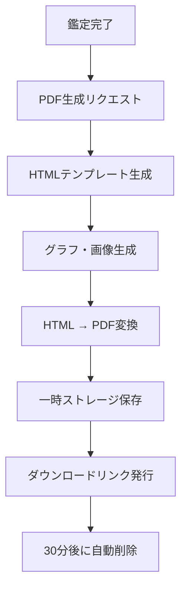
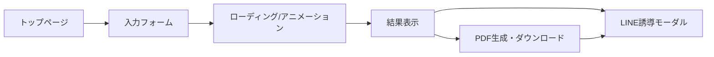

# 紫微斗数 金運特化型 無料鑑定サイト 仕様書

## 1. プロジェクト概要

### 1.1 サービス名称（案）
- 「紫微財運占い」
- 「紫微斗数 金運鑑定」

### 1.2 サービス概要
紫微斗数の伝統的な占術ロジックを用いて、ユーザーの金運・財運を詳細に鑑定する無料Webサービス。鑑定結果はPDFでダウンロード可能とし、LINE公式アカウントへの誘導を行う。

### 1.3 ターゲットユーザー
- 20〜50代の男女
- 金運・仕事運に興味がある方
- 投資・副業・キャリアアップを検討中の方
- 占い初心者〜中級者

### 1.4 ビジネスモデル
- 無料鑑定 → LINE登録誘導
- LINE経由での有料詳細鑑定への導線
- アフィリエイト連携（金融・転職系）

---

## 2. 機能要件

### 2.1 入力機能

#### 2.1.1 必須入力項目
| 項目 | 形式 | 説明 |
|------|------|------|
| 生年月日 | 日付選択 | 1920年〜現在まで |
| 出生時刻 | 時刻選択 | 2時間刻み（12時辰）または「不明」選択可 |
| 性別 | ラジオボタン | 男性/女性 |
| 暦法選択 | ラジオボタン | 新暦（グレゴリオ暦）/旧暦（農暦） |

#### 2.1.2 任意入力項目
| 項目 | 形式 | 説明 |
|------|------|------|
| ニックネーム | テキスト | PDF出力用（最大20文字） |
| 出生地 | 都道府県選択 | 時差補正用（オプション） |

#### 2.1.3 時辰対応表
```
子時: 23:00〜00:59
丑時: 01:00〜02:59
寅時: 03:00〜04:59
卯時: 05:00〜06:59
辰時: 07:00〜08:59
巳時: 09:00〜10:59
午時: 11:00〜12:59
未時: 13:00〜14:59
申時: 15:00〜16:59
酉時: 17:00〜18:59
戌時: 19:00〜20:59
亥時: 21:00〜22:59
```

### 2.2 出力機能

#### 2.2.1 鑑定結果表示（Web画面）
1. 金運総合スコア（100点満点）
2. 金運タイプ診断
3. 財帛宮の詳細解説
4. 適職・向いている職業
5. 成功パターン分析
6. 運勢グラフ（10年間）
7. 今年の金運アドバイス

#### 2.2.2 PDF出力
- A4縦 4〜6ページ構成
- 命盤図
- 詳細鑑定結果
- 運勢グラフ
- アドバイス

#### 2.2.3 LINE誘導
- 結果表示後のCTA
- PDF内QRコード
- 限定コンテンツ訴求

---

## 3. 紫微斗数ロジック詳細

### 3.1 命盤作成の基本アルゴリズム

#### 3.1.1 暦変換処理
```
1. 新暦入力の場合 → 旧暦（農暦）に変換
2. 変換ライブラリ: chinese-calendar または lunar-javascript
3. 閏月の処理: 閏月の場合は前月として計算
```

#### 3.1.2 五行局の決定
```javascript
// 五行局決定アルゴリズム
// 命宮の位置と生年干支から決定

const 五行局 = {
  水二局: 2,
  木三局: 3,
  金四局: 4,
  土五局: 5,
  火六局: 6
};

// 納音五行表に基づく計算
function calculate五行局(命宮地支, 生年干) {
  // 納音五行表参照ロジック
  // 天干と地支の組み合わせから五行を決定
}
```

#### 3.1.3 命宮・身宮の決定
```javascript
// 命宮位置の計算
function calculate命宮(生月, 生時) {
  // 寅宮を起点とし、生月を順行、生時を逆行
  const 基準宮 = 2; // 寅 = 2
  const 命宮位置 = (基準宮 + 生月 - 1 - 生時 + 12) % 12;
  return 地支[命宮位置];
}

// 身宮位置の計算
function calculate身宮(生月, 生時) {
  // 寅宮を起点とし、生月と生時を共に順行
  const 基準宮 = 2;
  const 身宮位置 = (基準宮 + 生月 - 1 + 生時) % 12;
  return 地支[身宮位置];
}
```

#### 3.1.4 十二宮の配置
```javascript
const 十二宮 = [
  "命宮",     // 本人の性格・人生の方向性
  "兄弟宮",   // 兄弟姉妹・同僚との関係
  "夫妻宮",   // 配偶者・パートナー運
  "子女宮",   // 子供運・投資（子孫=利益の象徴）
  "財帛宮",   // ★金運・収入・財産
  "疾厄宮",   // 健康・災難
  "遷移宮",   // 外出運・変化・対外関係
  "交友宮",   // 友人・部下・人脈
  "官禄宮",   // ★仕事運・キャリア・社会的地位
  "田宅宮",   // ★不動産・資産・家庭環境
  "福徳宮",   // ★精神的満足・投資センス
  "父母宮"    // 両親・目上との関係・相続
];
```

### 3.2 十四主星の配置

#### 3.2.1 紫微星系（6星）
```javascript
const 紫微星系 = {
  紫微: {
    五行: "土",
    陰陽: "陰",
    金運特性: "大きな財を動かす能力。権力と財が結びつく",
    配置: "五行局に基づく"
  },
  天機: {
    五行: "木",
    陰陽: "陰",
    金運特性: "知恵で財を生む。頭脳労働向き",
    配置: "紫微から逆行1宮"
  },
  太陽: {
    五行: "火",
    陰陽: "陽",
    金運特性: "表舞台での成功。名声とともに財が来る",
    配置: "紫微から逆行3宮"
  },
  武曲: {
    五行: "金",
    陰陽: "陰",
    金運特性: "★財星の筆頭。正財・実業向き",
    配置: "紫微から逆行4宮"
  },
  天同: {
    五行: "水",
    陰陽: "陽",
    金運特性: "穏やかな財運。安定志向",
    配置: "紫微から逆行5宮"
  },
  廉貞: {
    五行: "火",
    陰陽: "陰",
    金運特性: "次財星。権力・政治と結びつく財",
    配置: "紫微から逆行8宮"
  }
};
```

#### 3.2.2 天府星系（8星）
```javascript
const 天府星系 = {
  天府: {
    五行: "土",
    陰陽: "陽",
    金運特性: "★財庫の星。蓄財能力抜群",
    配置: "紫微と対照的位置"
  },
  太陰: {
    五行: "水",
    陰陽: "陰",
    金運特性: "★田宅財星。不動産・資産運用",
    配置: "天府から順行1宮"
  },
  貪狼: {
    五行: "水木",
    陰陽: "陽",
    金運特性: "投機・ギャンブル運。偏財",
    配置: "天府から順行2宮"
  },
  巨門: {
    五行: "水",
    陰陽: "陰",
    金運特性: "口才で財を得る。営業・交渉",
    配置: "天府から順行3宮"
  },
  天相: {
    五行: "水",
    陰陽: "陽",
    金運特性: "補佐で財を得る。組織内出世",
    配置: "天府から順行4宮"
  },
  天梁: {
    五行: "土",
    陰陽: "陽",
    金運特性: "清廉な財。公職・士業向き",
    配置: "天府から順行5宮"
  },
  七殺: {
    五行: "金火",
    陰陽: "陰",
    金運特性: "開拓精神で財を築く。起業家",
    配置: "天府から順行6宮"
  },
  破軍: {
    五行: "水",
    陰陽: "陰",
    金運特性: "破壊と創造。変革で財を得る",
    配置: "天府から順行10宮"
  }
};
```

#### 3.2.3 紫微星配置表（五行局別）
```javascript
const 紫微配置表 = {
  // 生日と五行局から紫微星の位置を決定
  // 水二局
  水二局: {
    1: "丑", 2: "寅", 3: "寅", 4: "卯", 5: "卯",
    6: "辰", 7: "辰", 8: "巳", 9: "巳", 10: "午",
    11: "午", 12: "未", 13: "未", 14: "申", 15: "申",
    16: "酉", 17: "酉", 18: "戌", 19: "戌", 20: "亥",
    21: "亥", 22: "子", 23: "子", 24: "丑", 25: "丑",
    26: "寅", 27: "寅", 28: "卯", 29: "卯", 30: "辰"
  },
  // 木三局、金四局、土五局、火六局も同様に定義
};
```

### 3.3 甲級星の配置

#### 3.3.1 四化星
```javascript
const 四化星 = {
  化禄: { 効果: "財運上昇・順調・利益", 金運影響: "++" },
  化権: { 効果: "権力・支配力・競争力", 金運影響: "+" },
  化科: { 効果: "名声・学問・評価", 金運影響: "+" },
  化忌: { 効果: "障害・損失・こだわり", 金運影響: "--" }
};

// 生年四化表
const 生年四化表 = {
  甲: { 化禄: "廉貞", 化権: "破軍", 化科: "武曲", 化忌: "太陽" },
  乙: { 化禄: "天機", 化権: "天梁", 化科: "紫微", 化忌: "太陰" },
  丙: { 化禄: "天同", 化権: "天機", 化科: "文昌", 化忌: "廉貞" },
  丁: { 化禄: "太陰", 化権: "天同", 化科: "天機", 化忌: "巨門" },
  戊: { 化禄: "貪狼", 化権: "太陰", 化科: "右弼", 化忌: "天機" },
  己: { 化禄: "武曲", 化権: "貪狼", 化科: "天梁", 化忌: "文曲" },
  庚: { 化禄: "太陽", 化権: "武曲", 化科: "太陰", 化忌: "天同" },
  辛: { 化禄: "巨門", 化権: "太陽", 化科: "文曲", 化忌: "文昌" },
  壬: { 化禄: "天梁", 化権: "紫微", 化科: "左輔", 化忌: "武曲" },
  癸: { 化禄: "破軍", 化権: "巨門", 化科: "太陰", 化忌: "貪狼" }
};
```

#### 3.3.2 左輔・右弼
```javascript
// 左輔: 生月から順行配置
// 右弼: 生月から逆行配置
function calculate輔弼(生月) {
  const 左輔位置 = (生月 + 3) % 12; // 辰宮起点
  const 右弼位置 = (10 - 生月 + 12) % 12; // 戌宮起点
  return { 左輔: 地支[左輔位置], 右弼: 地支[右弼位置] };
}
```

#### 3.3.3 文昌・文曲
```javascript
// 文昌: 生時から逆行配置
// 文曲: 生時から順行配置
function calculate文昌文曲(生時) {
  const 文昌位置 = (10 - 生時 + 12) % 12; // 戌宮起点逆行
  const 文曲位置 = (生時 + 4) % 12; // 辰宮起点順行
  return { 文昌: 地支[文昌位置], 文曲: 地支[文曲位置] };
}
```

#### 3.3.4 天魁・天鉞（貴人星）
```javascript
const 魁鉞配置表 = {
  甲戊庚: { 天魁: "丑", 天鉞: "未" },
  乙己: { 天魁: "子", 天鉞: "申" },
  丙丁: { 天魁: "亥", 天鉞: "酉" },
  壬癸: { 天魁: "卯", 天鉞: "巳" },
  辛: { 天魁: "午", 天鉞: "寅" }
};
```

#### 3.3.5 禄存・天馬
```javascript
// 禄存: 財星の代表格
const 禄存配置表 = {
  甲: "寅", 乙: "卯", 丙: "巳", 丁: "午",
  戊: "巳", 己: "午", 庚: "申", 辛: "酉",
  壬: "亥", 癸: "子"
};

// 天馬: 活動・変動の星
const 天馬配置表 = {
  寅午戌年: "申",
  申子辰年: "寅",
  巳酉丑年: "亥",
  亥卯未年: "巳"
};
```

### 3.4 乙級星・丙級星の配置

#### 3.4.1 煞星（凶星）
```javascript
const 煞星 = {
  擎羊: "禄存の前一宮",
  陀羅: "禄存の後一宮",
  火星: "生年支と生時から決定",
  鈴星: "生年支と生時から決定",
  地空: "生時から配置",
  地劫: "生時から配置"
};

// 擎羊・陀羅
function calculate羊陀(生年干) {
  const 禄存位置 = 禄存配置表[生年干];
  const 擎羊位置 = (地支.indexOf(禄存位置) + 1) % 12;
  const 陀羅位置 = (地支.indexOf(禄存位置) - 1 + 12) % 12;
  return { 擎羊: 地支[擎羊位置], 陀羅: 地支[陀羅位置] };
}
```

#### 3.4.2 吉星
```javascript
const 吉星 = {
  天官: "生年干から決定",
  天福: "生年干から決定",
  天廚: "生年干から決定（食禄星）",
  龍池: "生年支から決定",
  鳳閣: "生年支から決定"
};
```

### 3.5 大限・小限・流年の計算

#### 3.5.1 大限（10年運）
```javascript
function calculate大限(五行局, 性別, 年干陰陽) {
  // 起運年齢 = 五行局の数値
  const 起運年齢 = 五行局;
  
  // 順行・逆行の決定
  // 陽年生まれ男性・陰年生まれ女性 = 順行
  // 陰年生まれ男性・陽年生まれ女性 = 逆行
  const 陽年干 = ["甲", "丙", "戊", "庚", "壬"];
  const 年干是陽 = 陽年干.includes(年干);
  const 順行 = (年干是陽 && 性別 === "男") || (!年干是陽 && 性別 === "女");
  
  // 大限の宮位配列を生成
  // 命宮から開始し、順行または逆行で10年ごとに移動
}
```

#### 3.5.2 流年（年運）
```javascript
function calculate流年(生年支, 対象年) {
  // その年の干支から流年命宮を決定
  // 流年四化を適用
  const 流年干支 = get年干支(対象年);
  const 流年四化 = 生年四化表[流年干支.干];
  // 流年十二宮の運勢を計算
}
```

---

## 4. 金運鑑定ロジック

### 4.1 金運タイプ分類

#### 4.1.1 8つの金運タイプ
```javascript
const 金運タイプ = {
  "帝王財運型": {
    条件: "紫微在財帛宮 または 財帛宮に化禄+左輔右弼",
    特徴: "大きなスケールの財運。経営者・投資家向き",
    成功パターン: "組織を率いて大きな事業を展開",
    適職: ["CEO", "経営者", "投資ファンド", "政治家"]
  },
  "実業家型": {
    条件: "武曲在財帛宮 または 武曲化禄",
    特徴: "コツコツ型の正財運。実業で財を築く",
    成功パターン: "専門技能を磨き、実力で稼ぐ",
    適職: ["銀行員", "会計士", "製造業", "IT技術者"]
  },
  "蓄財型": {
    条件: "天府在財帛宮 または 田宅宮に吉星集中",
    特徴: "貯蓄能力が高い。資産を守り増やす",
    成功パターン: "長期投資と堅実な資産形成",
    適職: ["資産運用", "不動産", "保険", "公務員"]
  },
  "投機型": {
    条件: "貪狼在財帛宮 または 貪狼化禄",
    特徴: "偏財運・ギャンブル運あり。投機向き",
    成功パターン: "リスクを取って大きなリターン",
    適職: ["トレーダー", "営業", "芸能", "飲食業"]
  },
  "知識財型": {
    条件: "天機在財帛宮 または 文昌文曲在財帛宮",
    特徴: "頭脳労働で財を得る。知的財産",
    成功パターン: "専門知識やスキルの monetization",
    適職: ["コンサルタント", "教師", "ライター", "エンジニア"]
  },
  "名声財型": {
    条件: "太陽在財帛宮（廟旺） または 太陽化禄",
    特徴: "名声とともに財が来る。表舞台向き",
    成功パターン: "社会的評価を高めて収入増",
    適職: ["政治家", "医師", "弁護士", "インフルエンサー"]
  },
  "不動産財型": {
    条件: "太陰在財帛宮 または 田宅宮に太陰",
    特徴: "不動産・資産運用で財を築く",
    成功パターン: "不動産投資・賃貸収入",
    適職: ["不動産業", "建築", "インテリア", "資産管理"]
  },
  "開拓者型": {
    条件: "七殺在財帛宮 または 破軍在財帛宮",
    特徴: "ゼロから財を築く。起業家タイプ",
    成功パターン: "新規事業・ベンチャー",
    適職: ["起業家", "フリーランス", "営業", "冒険家"]
  }
};
```

### 4.2 金運スコア計算

#### 4.2.1 基本スコア算出
```javascript
function calculate金運スコア(命盤) {
  let score = 50; // 基準点
  
  // 財帛宮の評価
  score += evaluate財帛宮(命盤.財帛宮);
  
  // 官禄宮の評価（仕事運）
  score += evaluate官禄宮(命盤.官禄宮) * 0.3;
  
  // 田宅宮の評価（資産運）
  score += evaluate田宅宮(命盤.田宅宮) * 0.2;
  
  // 福徳宮の評価（投資センス）
  score += evaluate福徳宮(命盤.福徳宮) * 0.2;
  
  // 禄存の位置による加点
  score += evaluate禄存(命盤.禄存位置);
  
  // 四化の影響
  score += evaluate四化影響(命盤);
  
  // スコアを0-100に正規化
  return Math.max(0, Math.min(100, score));
}
```

#### 4.2.2 宮位評価関数
```javascript
function evaluate財帛宮(宮情報) {
  let point = 0;
  
  // 主星評価
  const 財星 = ["武曲", "天府", "太陰", "禄存"];
  const 吉星 = ["紫微", "天相", "天梁"];
  const 凶星 = ["擎羊", "陀羅", "火星", "鈴星", "地空", "地劫"];
  
  宮情報.主星.forEach(star => {
    if (財星.includes(star)) point += 15;
    if (吉星.includes(star)) point += 10;
  });
  
  // 四化評価
  if (宮情報.四化.includes("化禄")) point += 20;
  if (宮情報.四化.includes("化権")) point += 10;
  if (宮情報.四化.includes("化科")) point += 8;
  if (宮情報.四化.includes("化忌")) point -= 15;
  
  // 煞星評価
  宮情報.煞星.forEach(star => {
    if (凶星.includes(star)) point -= 8;
  });
  
  // 左輔右弼・文昌文曲
  if (宮情報.includes("左輔")) point += 5;
  if (宮情報.includes("右弼")) point += 5;
  
  return point;
}
```

### 4.3 適職判定ロジック

#### 4.3.1 職業カテゴリーマッピング
```javascript
const 職業カテゴリー = {
  金融系: {
    星曜条件: ["武曲", "天府", "太陰"],
    職種: ["銀行員", "証券アナリスト", "会計士", "税理士", "ファイナンシャルプランナー"]
  },
  経営者系: {
    星曜条件: ["紫微", "天府", "七殺"],
    職種: ["CEO", "起業家", "経営コンサルタント", "事業オーナー"]
  },
  クリエイティブ系: {
    星曜条件: ["貪狼", "文昌", "文曲", "天機"],
    職種: ["デザイナー", "クリエイター", "アーティスト", "ライター"]
  },
  技術系: {
    星曜条件: ["天機", "武曲", "巨門"],
    職種: ["エンジニア", "プログラマー", "研究者", "技術者"]
  },
  営業販売系: {
    星曜条件: ["貪狼", "巨門", "太陽"],
    職種: ["営業", "販売", "マーケター", "広報"]
  },
  専門職系: {
    星曜条件: ["天梁", "太陽", "天相"],
    職種: ["医師", "弁護士", "教師", "コンサルタント"]
  },
  不動産資産系: {
    星曜条件: ["太陰", "天府", "天同"],
    職種: ["不動産業", "資産運用", "投資家", "賃貸オーナー"]
  },
  公務員安定系: {
    星曜条件: ["天同", "天梁", "天相"],
    職種: ["公務員", "大企業社員", "団体職員"]
  }
};

function recommend適職(命盤) {
  const 官禄宮主星 = 命盤.官禄宮.主星;
  const 財帛宮主星 = 命盤.財帛宮.主星;
  const 命宮主星 = 命盤.命宮.主星;
  
  const recommendations = [];
  
  Object.entries(職業カテゴリー).forEach(([category, info]) => {
    let matchScore = 0;
    
    info.星曜条件.forEach(star => {
      if (官禄宮主星.includes(star)) matchScore += 3;
      if (財帛宮主星.includes(star)) matchScore += 2;
      if (命宮主星.includes(star)) matchScore += 1;
    });
    
    if (matchScore >= 3) {
      recommendations.push({
        category,
        職種: info.職種,
        matchScore
      });
    }
  });
  
  return recommendations.sort((a, b) => b.matchScore - a.matchScore);
}
```

### 4.4 成功パターン分析

#### 4.4.1 成功パターン定義
```javascript
const 成功パターン = {
  "コツコツ積み上げ型": {
    判定条件: {
      財帛宮: ["武曲", "天府", "天相"],
      特徴: "煞星が少ない",
      大限運: "安定上昇"
    },
    解説: "地道な努力と堅実な積み重ねで財を築くタイプ",
    アドバイス: "派手な投機は避け、専門性を磨き続けることで成功",
    成功時期: "40代以降に花開く傾向"
  },
  "一攫千金型": {
    判定条件: {
      財帛宮: ["貪狼", "破軍"],
      特徴: "化禄あり",
      大限運: "変動大"
    },
    解説: "大きなチャンスを掴んで一気に財を得るタイプ",
    アドバイス: "直感を信じつつも、リスク管理を怠らないこと",
    成功時期: "30代でチャンス到来の可能性"
  },
  "人脈活用型": {
    判定条件: {
      財帛宮: ["太陽", "紫微"],
      特徴: "天魁天鉞あり、左輔右弼あり"
    },
    解説: "人脈と信頼関係から財運が開けるタイプ",
    アドバイス: "人との縁を大切にし、ネットワークを広げること",
    成功時期: "人間関係の構築後、徐々に上昇"
  },
  "専門技能型": {
    判定条件: {
      財帛宮: ["天機", "巨門"],
      特徴: "文昌文曲あり"
    },
    解説: "高度な専門知識やスキルで財を得るタイプ",
    アドバイス: "常に学び続け、スキルを最新に保つこと",
    成功時期: "専門性確立後の30代後半から"
  },
  "資産運用型": {
    判定条件: {
      田宅宮: ["太陰", "天府"],
      特徴: "化禄あり"
    },
    解説: "資産運用や不動産投資で財を増やすタイプ",
    アドバイス: "早めに資産形成を始め、複利効果を活かす",
    成功時期: "資産が雪だるま式に増える50代以降"
  }
};
```

---

## 5. 運勢グラフ設計

### 5.1 グラフ種類

#### 5.1.1 10年間金運グラフ
```javascript
const グラフ設計 = {
  種類: "折れ線グラフ + エリアグラフ",
  X軸: "年（現在年から+10年）",
  Y軸: "金運指数（0-100）",
  表示要素: [
    "総合金運ライン",
    "収入運（サブライン）",
    "資産運（サブライン）",
    "投資運（サブライン）"
  ],
  インタラクション: "ホバーで詳細表示"
};
```

#### 5.1.2 大限運グラフ（生涯）
```javascript
const 大限グラフ = {
  種類: "棒グラフ + 折れ線",
  X軸: "年齢（大限区間）",
  Y軸: "運勢指数",
  表示区間: "0歳〜80歳",
  ハイライト: "現在の大限を強調"
};
```

### 5.2 運勢指数計算

```javascript
function calculate年間金運(命盤, 対象年) {
  const 流年干支 = get年干支(対象年);
  const 大限情報 = get大限(命盤, 対象年);
  
  let 金運指数 = 50;
  
  // 大限の財帛宮評価
  金運指数 += evaluate大限財帛(大限情報);
  
  // 流年四化の影響
  const 流年四化 = calculate流年四化(流年干支);
  金運指数 += evaluate流年四化影響(流年四化, 命盤);
  
  // 流年の財帛宮評価
  const 流年財帛 = calculate流年財帛(流年干支, 命盤);
  金運指数 += evaluate流年財帛(流年財帛);
  
  // 太歳の影響
  金運指数 += evaluate太歳影響(流年干支, 命盤.生年支);
  
  return {
    year: 対象年,
    score: Math.max(0, Math.min(100, 金運指数)),
    description: generate運勢描述(金運指数)
  };
}
```

### 5.3 グラフ実装仕様

#### 5.3.1 使用ライブラリ
```
- Chart.js または Recharts（React使用時）
- レスポンシブ対応必須
- アニメーション効果付き
```

#### 5.3.2 カラースキーム
```css
:root {
  --color-excellent: #FFD700;  /* 金色：絶好調 80-100 */
  --color-good: #4CAF50;       /* 緑：好調 60-79 */
  --color-normal: #2196F3;     /* 青：普通 40-59 */
  --color-caution: #FF9800;    /* オレンジ：注意 20-39 */
  --color-warning: #F44336;    /* 赤：要注意 0-19 */
}
```

---

## 6. 鑑定結果詳細解説テンプレート

### 6.1 財帛宮解説テンプレート

```javascript
const 財帛宮解説テンプレート = {
  header: "{主星}在財帛宮の金運",
  
  基本解説: `
    あなたの財帛宮には{主星}が座しています。
    {主星}は{五行}の星で、{基本特徴}という特徴を持ちます。
    
    【金運の傾向】
    {金運傾向}
    
    【収入パターン】
    {収入パターン}
    
    【注意点】
    {注意点}
  `,
  
  四化影響: {
    化禄: "財帛宮に化禄が入ることで、金運が大きく開けています。{詳細}",
    化権: "財帛宮に化権が入り、財を得る力と競争力が増しています。{詳細}",
    化科: "財帛宮に化科が入り、評価や名声を通じて財が入りやすくなっています。{詳細}",
    化忌: "財帛宮に化忌が入っているため、金銭面で苦労しやすい傾向があります。{詳細}"
  }
};
```

### 6.2 主星別解説データ

```javascript
const 主星解説データ = {
  紫微: {
    財帛宮: {
      基本: "帝王の星が財帛宮にあるあなたは、大きなスケールの財運を持ちます。",
      金運傾向: "権力や地位と結びついた財運。組織のトップに立つことで財が集まる",
      収入パターン: "経営者としての収入、権威を活かした高収入",
      適職: "CEO、経営者、政治家、大企業幹部",
      注意点: "プライドの高さが財運を妨げることも。謙虚さを忘れずに"
    }
  },
  武曲: {
    財帛宮: {
      基本: "財星の筆頭・武曲が財帛宮にあるあなたは、抜群の金運の持ち主です。",
      金運傾向: "正財運が非常に強い。実力と努力で確実に財を築く",
      収入パターン: "専門技能による高収入、実業での成功",
      適職: "金融業、会計士、IT技術者、製造業経営",
      注意点: "金銭へのこだわりが強すぎると人間関係に影響も"
    }
  },
  天府: {
    財帛宮: {
      基本: "財庫の星・天府が財帛宮にあるあなたは、蓄財能力に優れています。",
      金運傾向: "貯蓄運・資産形成運が非常に強い",
      収入パターン: "安定収入を着実に積み上げ、資産を守り育てる",
      適職: "資産運用、不動産、保険、公務員",
      注意点: "守りに入りすぎると機会を逃すことも"
    }
  },
  // ... 他の主星も同様に定義
};
```

---

## 7. PDF出力仕様

### 7.1 PDF構成

```
【全6ページ構成】

Page 1: 表紙・基本情報
- サービスロゴ
- 鑑定日時
- ニックネーム
- 生年月日・時刻
- 金運総合スコア（大きく表示）
- 金運タイプ（アイコン付き）

Page 2: 命盤図
- 12宮の配置図
- 主星の配置
- 四化星の表示
- 財帛宮・官禄宮・田宅宮をハイライト

Page 3: 金運詳細解説
- 財帛宮の解説
- あなたの金運タイプとは
- 成功パターン分析

Page 4: 適職・キャリア
- 向いている職業TOP5
- 各職業の解説
- キャリアアドバイス

Page 5: 運勢グラフ
- 10年間金運グラフ
- 大限運グラフ
- 今年のアドバイス

Page 6: LINE誘導・フッター
- 「もっと詳しい鑑定を受けたい方へ」
- LINE QRコード
- 限定特典の案内
- 免責事項・著作権表示
```

### 7.2 PDF生成技術

```javascript
// 推奨ライブラリ
const PDF生成技術 = {
  サーバーサイド: "Puppeteer + HTML/CSS → PDF",
  代替案1: "jsPDF + html2canvas",
  代替案2: "PDFKit",
  
  フォント: [
    "Noto Sans JP",
    "源ノ角ゴシック"
  ],
  
  画像形式: "PNG（グラフ・命盤図）",
  解像度: "300dpi",
  ファイルサイズ目安: "2-3MB以下"
};
```

### 7.3 PDF生成フロー



---

## 8. LINE連携設計

### 8.1 LINE誘導ポイント

```javascript
const LINE誘導設計 = {
  誘導ポイント: [
    {
      タイミング: "鑑定結果表示直後",
      配置: "結果画面上部（ファーストビュー）",
      訴求: "【期間限定】LINE登録で詳細鑑定プレゼント！",
      CTA: "今すぐ受け取る"
    },
    {
      タイミング: "PDF内",
      配置: "最終ページ",
      訴求: "毎月の金運情報をLINEでお届け",
      CTA: "QRコードからお友達追加"
    },
    {
      タイミング: "ダウンロード完了後",
      配置: "モーダル",
      訴求: "鑑定結果をさらに深掘り！",
      CTA: "LINE友達追加する"
    }
  ],
  
  LINE特典: [
    "毎月の金運カレンダー",
    "ラッキーカラー・ラッキーアイテム",
    "有料鑑定の割引クーポン",
    "金運アップ開運情報"
  ]
};
```

### 8.2 LINE Messaging API連携

```javascript
const LINE設定 = {
  登録方式: "友達追加ボタン + QRコード",
  リッチメニュー: {
    項目1: "今月の金運",
    項目2: "詳細鑑定申込",
    項目3: "開運アドバイス",
    項目4: "お問い合わせ"
  },
  自動応答: {
    初回メッセージ: "ご登録ありがとうございます！{特典案内}",
    定期配信: "毎月1日に金運情報配信"
  }
};
```

---

## 9. 技術仕様

### 9.1 システムアーキテクチャ

```
┌─────────────────────────────────────────────────────────────┐
│                        Frontend                              │
│  ┌─────────────┐  ┌─────────────┐  ┌─────────────────────┐  │
│  │   入力Form   │  │  結果表示    │  │    グラフ表示       │  │
│  │  (React)    │  │  (React)    │  │  (Chart.js/Recharts)│  │
│  └─────────────┘  └─────────────┘  └─────────────────────┘  │
└─────────────────────────────────────────────────────────────┘
                              │
                              ▼
┌─────────────────────────────────────────────────────────────┐
│                        Backend                               │
│  ┌─────────────────────────────────────────────────────────┐│
│  │                    API Server                            ││
│  │  ┌───────────┐  ┌───────────┐  ┌───────────────────────┐││
│  │  │ 暦変換    │  │ 命盤計算  │  │  鑑定ロジック        │││
│  │  │ Module    │  │ Module    │  │  (金運スコア・解説)  │││
│  │  └───────────┘  └───────────┘  └───────────────────────┘││
│  │  ┌───────────┐  ┌───────────────────────────────────────┐││
│  │  │ PDF生成   │  │          グラフ生成                   │││
│  │  │ (Puppeteer)│ │         (Chart.js SSR)                │││
│  │  └───────────┘  └───────────────────────────────────────┘││
│  └─────────────────────────────────────────────────────────┘│
└─────────────────────────────────────────────────────────────┘
                              │
                              ▼
┌─────────────────────────────────────────────────────────────┐
│                      Infrastructure                          │
│  ┌───────────┐  ┌───────────┐  ┌───────────────────────────┐│
│  │  Vercel/  │  │   Redis   │  │       S3/Cloud Storage    ││
│  │  AWS      │  │  (Cache)  │  │       (PDF一時保存)       ││
│  └───────────┘  └───────────┘  └───────────────────────────┘│
└─────────────────────────────────────────────────────────────┘
```

### 9.2 技術スタック

```yaml
Frontend:
  Framework: Next.js 14 (App Router)
  UI: Tailwind CSS + shadcn/ui
  グラフ: Recharts または Chart.js
  状態管理: Zustand または React Context
  フォーム: React Hook Form + Zod

Backend:
  Runtime: Node.js 20+
  Framework: Next.js API Routes または Express
  暦変換: lunar-javascript
  PDF生成: Puppeteer または jsPDF

Infrastructure:
  Hosting: Vercel または AWS
  CDN: Cloudflare
  Storage: AWS S3 または Cloudflare R2
  Monitoring: Sentry

External Services:
  LINE: LINE Messaging API
  Analytics: Google Analytics 4 + Mixpanel
```

### 9.3 API設計

```yaml
POST /api/fortune/calculate:
  description: 命盤計算・鑑定実行
  request:
    body:
      birthDate: string (YYYY-MM-DD)
      birthTime: string (HH:MM)
      gender: "male" | "female"
      calendarType: "solar" | "lunar"
      nickname?: string
  response:
    命盤: object
    金運スコア: number
    金運タイプ: string
    適職: array
    成功パターン: object
    年間運勢: array

POST /api/fortune/pdf:
  description: PDF生成
  request:
    body:
      fortuneData: object (計算結果)
  response:
    pdfUrl: string (一時ダウンロードURL)
    expiresAt: string (有効期限)

GET /api/fortune/graph:
  description: グラフデータ取得
  request:
    query:
      startYear: number
      endYear: number
      fortuneId: string
  response:
    graphData: array
```

---

## 10. UI/UXデザイン

### 10.1 画面遷移



### 10.2 レスポンシブ対応

```yaml
ブレークポイント:
  mobile: 0-767px
  tablet: 768-1023px
  desktop: 1024px+

注意点:
  - モバイルファースト設計
  - 命盤図はピンチズーム対応
  - グラフは横スクロール対応
  - PDF閲覧はアプリ内ビューア使用
```

### 10.3 デザインコンセプト

```yaml
テーマ: 高級感 + 神秘性 + 信頼感

カラーパレット:
  Primary: #8B5CF6 (紫)
  Secondary: #FFD700 (金)
  Background: #0F0F1A (濃紺)
  Text: #FFFFFF / #A0A0C0
  Accent: #22D3EE (シアン)

フォント:
  見出し: Noto Serif JP
  本文: Noto Sans JP

ビジュアル要素:
  - 星空・銀河のモチーフ
  - 金色のアクセント
  - グラデーション効果
  - 微細なパーティクルアニメーション
```

---

## 11. セキュリティ・プライバシー

### 11.1 個人情報取り扱い

```yaml
収集情報:
  - 生年月日
  - 出生時刻
  - 性別
  - ニックネーム（任意）

保存ポリシー:
  - セッション中のみ保持
  - サーバー側での永続保存なし
  - PDF生成後30分で自動削除

注意事項:
  - 会員登録不要
  - Cookie: 分析用のみ（同意取得）
  - プライバシーポリシー掲載必須
```

### 11.2 セキュリティ対策

```yaml
実装項目:
  - HTTPS必須
  - Rate Limiting（API）
  - Input Validation（Zod）
  - XSS対策
  - CSRF対策
  - Content Security Policy
```

---

## 12. テスト仕様

### 12.1 テストケース

```yaml
命盤計算テスト:
  - 各五行局での紫微星配置
  - 天府星系の配置
  - 四化星の正確性
  - 煞星の配置

金運計算テスト:
  - スコア算出の境界値
  - 各タイプ判定の正確性
  - 適職マッチングの妥当性

運勢グラフテスト:
  - 10年間データの連続性
  - 大限切り替わりの処理
  - 流年四化の影響

PDF生成テスト:
  - レイアウト崩れ確認
  - 文字化け確認
  - ダウンロード機能
```

### 12.2 ブラウザ対応

```yaml
対応ブラウザ:
  - Chrome 最新2バージョン
  - Safari 最新2バージョン
  - Firefox 最新2バージョン
  - Edge 最新2バージョン

モバイル:
  - iOS Safari
  - Android Chrome
```

---

## 13. 開発スケジュール（参考）

```yaml
Phase 1 (2週間):
  - 要件定義確定
  - 紫微斗数ロジック実装
  - 暦変換機能実装

Phase 2 (2週間):
  - フロントエンド開発
  - 結果表示画面
  - グラフ実装

Phase 3 (1週間):
  - PDF生成機能
  - ダウンロード機能

Phase 4 (1週間):
  - LINE連携
  - テスト・デバッグ
  - リリース準備

合計: 約6週間
```

---

## 14. 運用・保守

### 14.1 モニタリング

```yaml
監視項目:
  - サーバー稼働率
  - API応答時間
  - エラー率
  - PDF生成成功率
  - LINE登録率（コンバージョン）

ツール:
  - Sentry（エラー監視）
  - Vercel Analytics（パフォーマンス）
  - Google Analytics（ユーザー行動）
```

### 14.2 改善サイクル

```yaml
定期レビュー:
  - 週次: エラー・パフォーマンス確認
  - 月次: ユーザーフィードバック分析
  - 四半期: 機能改善・追加検討
```

---

## 15. 免責事項・法的注意

```yaml
必要表示:
  - 占いは娯楽目的であり、意思決定の唯一の根拠とすべきではない
  - 投資・金融判断は自己責任で行うこと
  - 紫微斗数の解釈には諸説あり
  - 著作権・商標の表示

特定商取引法:
  - 無料サービスのため不要
  - 有料サービス展開時は別途対応
```

---

## 付録A: 紫微斗数用語集

| 用語 | 説明 |
|------|------|
| 命盤 | 個人の運命を示す12宮の配置図 |
| 財帛宮 | 金銭・財産を司る宮 |
| 官禄宮 | 仕事・キャリアを司る宮 |
| 田宅宮 | 不動産・資産を司る宮 |
| 福徳宮 | 精神的満足・投資センスを司る宮 |
| 大限 | 10年ごとの運勢周期 |
| 流年 | 1年ごとの運勢 |
| 四化 | 化禄・化権・化科・化忌の総称 |
| 煞星 | 凶作用を持つ星の総称 |

---

## 付録B: 参考資料

1. 紫微斗数全書（陳希夷著）
2. 紫微斗数講義（了無居士著）
3. 飛星紫微斗数（欽天四化派）
4. 台湾式紫微斗数標準教科書

---

*本仕様書 Version 1.0*
*作成日: 2024年*
